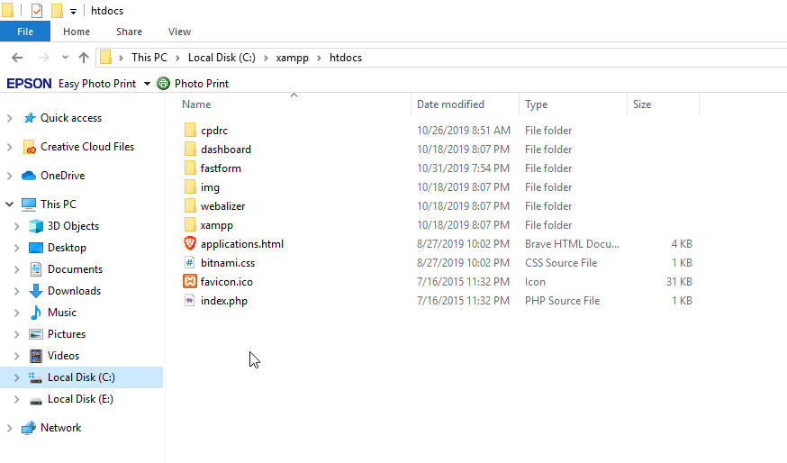
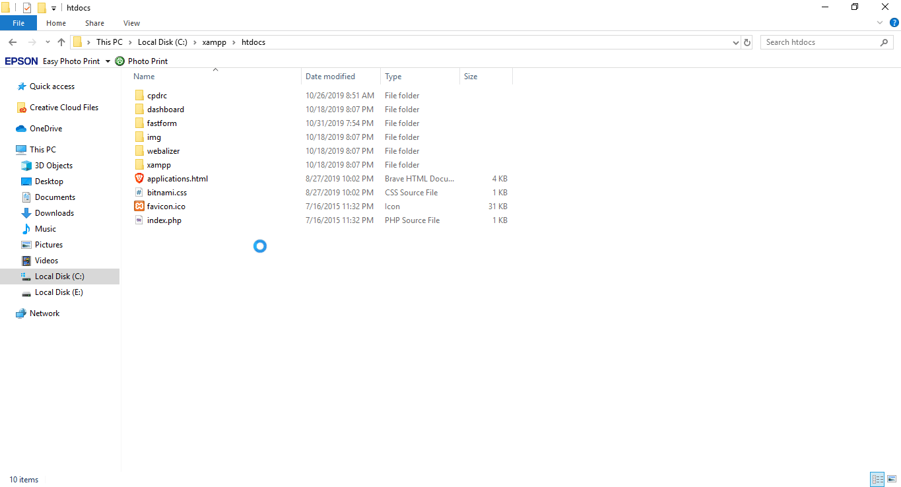
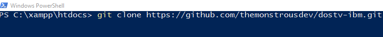
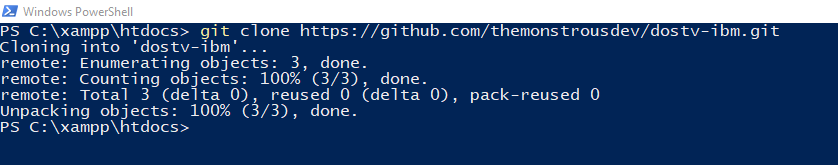
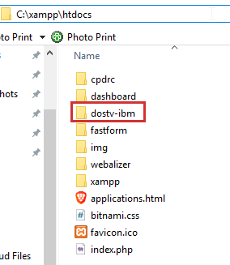
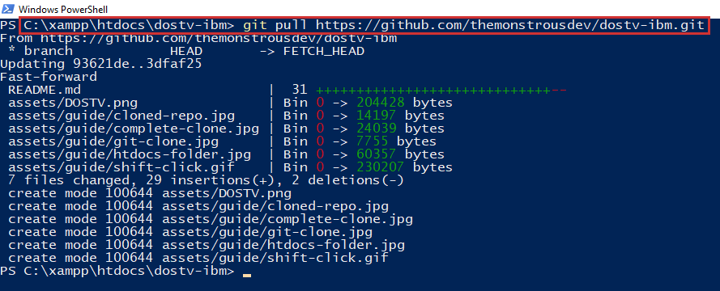
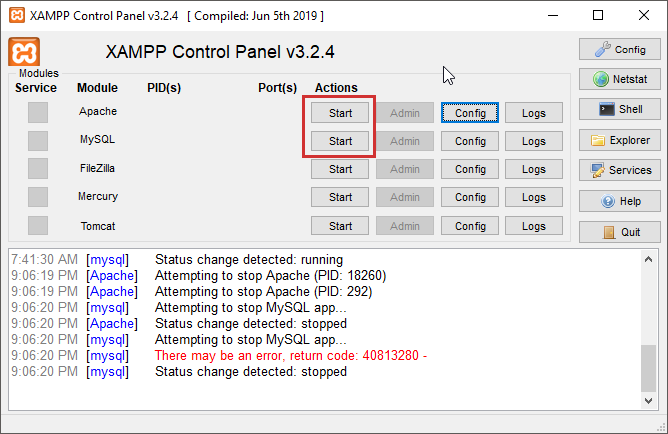
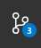

  

#
## Table of Contents
  1. [Steps to Tracking the Repo](#track-the-repository)
  
  2. [Contributing Code](#code-sharing-with-git)

#

### Track The Repository
1. [Download Git](https://git-scm.com/downloads)
2. [Download XAMPP](https://www.apachefriends.org/download.html)
3. Clone this repository in your XAMPP > htdocs folder. [How?](#clone-repository)

#

#### Clone Repository
**Note:** Make sure you have Git and Xampp installed.

1. Open your File Explorer and enter the address `C:\xampp\htdocs`

2. Hold `Shift` while right clicking in the folder and select `Open Windows Powershell` or `Open Console Command`

3. Type in `git clone https://github.com/themonstrousdev/dostv-ibm.git` in Windows Powershell/Console Command and hit `Enter`.

4. The folder should now appear in your htdocs folder.

#

#### Update Repository
- To update the folder to match the changes in the online repository, follow step 2 inside your dostv-ibm folder and type `git pull https://github.com/themonstrousdev/dostv-ibm.git`.

#

#### View Mock up Website
1. To view the website, open XAMPP and turn on Apache and MySQL (for when we have backend.)

2. Navigate to your preferred browser and type in the address `localhost/dostv-ibm` and you should be able to view the website as intended.

#

### Code Sharing With Git
1. Make a [Github](https://www.github.com) account and send me your Github username.

2. [Download Git](https://git-scm.com/downloads)
3. [Download XAMPP](https://www.apachefriends.org/download.html)
4. [Download Visual Studio Code](https://code.visualstudio.com/)
5. [Clone the Repo](#clone-repository)
6. Open VSCode and open your `dostv-ibm` folder.
7. **Before starting to code, always do a pull request.** Navigate to the third tab on the left (Git symbol) 

    

8. Select the three small buttons on the top right hand-side of the sidebar and select `Pull from...`. Choose the option `origin`.
