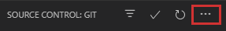

  

#
## Table of Contents
  1. [Steps to Tracking the Repo](#track-the-repository)
    
     - [Clone Repository](#clone-repository)
     - [Update Repository](#update-repository)
     - [View Site](#view-mock-up-website)
  
  2. [Contributing Code](#code-sharing-with-git)

#

### Track The Repository
1. [Download Git](https://git-scm.com/downloads)
2. [Download XAMPP](https://www.apachefriends.org/download.html)
3. Clone this repository in your XAMPP > htdocs folder. [How?](#clone-repository)

#

#### Clone Repository
**Note:** Make sure you have Git and Xampp installed.

1. Open your File Explorer and enter the address `C:\xampp\htdocs`

2. Hold `Shift` while right clicking in the folder and select `Open Windows Powershell` or `Open Console Command`

3. Type in `git clone https://github.com/themonstrousdev/dostv-ibm.git` in Windows Powershell/Console Command and hit `Enter`.

4. The folder should now appear in your htdocs folder.

#

#### Update Repository
- To update the folder to match the changes in the online repository, follow step 2 inside your dostv-ibm folder and type `git pull https://github.com/themonstrousdev/dostv-ibm.git`.

#

#### View Mock up Website
1. To view the website, open XAMPP and turn on Apache and MySQL (for when we have backend.)

2. Navigate to your preferred browser and type in the address `localhost/dostv-ibm` and you should be able to view the website as intended.

#

### Code Sharing With Git
1. Make a [Github](https://www.github.com) account and send me your Github username.

2. [Download Git](https://git-scm.com/downloads)
3. [Download XAMPP](https://www.apachefriends.org/download.html)
4. [Download Visual Studio Code](https://code.visualstudio.com/)
5. [Clone the Repo](#clone-repository)
6. Open VSCode and open your `dostv-ibm` folder.
7. **WHEN YOU FIRST OPEN VSCODE AND THE REPOSITORY, DO NOT SKIP THIS STEP.** Navigate to the Git tab (third tab on the left) 
    

    Open the Git Menu (three small buttons on the top right hand-side of the sidebar) and select `Check out to...` and choose the option `origin/dev`.

    

8. **Before starting any code session, always do a pull request.** Open the Git Menu and select `Pull from...`. Choose the option `origin` > `origin/master`. Check that your Git commit input bar (located under the Git sidebar header) says `Message (Ctrl+Enter to commit on 'dev')`. If it does not, follow step 7.

9. **After a coding session, always stage, commit, and push.** All changes should appear under the `Changes` category in your Git tab. To stage a change, hover over the file name, and click the `+` sign that appears on the left hand side.

    

    The file/s you've staged, should then appear in a new category called `Staged Changes`.

    

    Type in the Git commit input bar the type of change these files are.

    

    Hit `Ctrl + Enter` and the staged changes should then be committed. Once you have staged and committed all changes, open the Git menu and select `Push`.